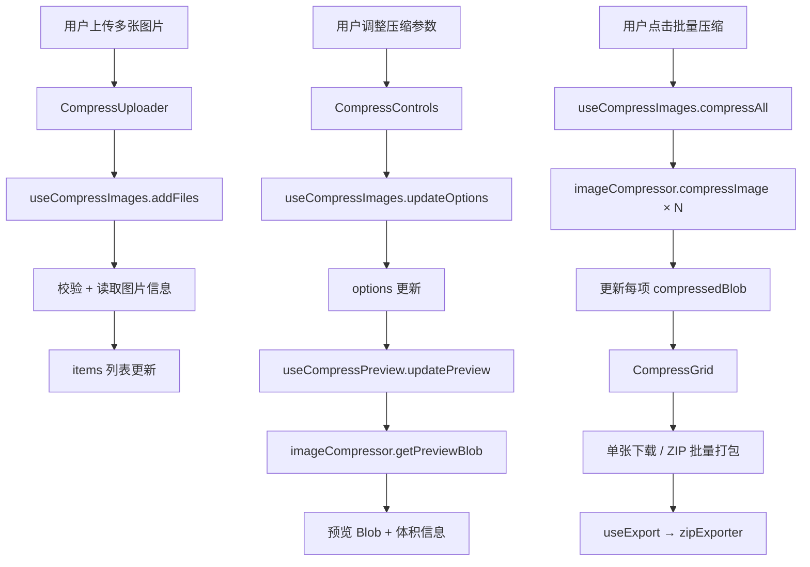

# 技术方案：图片压缩功能

## 1. 设计概述

为表情包裁剪工具新增独立的图片压缩模块，通过顶部 Tab 导航切换。核心压缩能力基于 Canvas API 实现，PNG→JPEG 使用 `toBlob()` 的 quality 参数实现有损压缩，PNG→PNG 仅支持尺寸缩放。

### 技术决策记录

| 决策项 | 选择 | 理由 |
|--------|------|------|
| PNG 有损压缩 | 不引入量化库，仅支持尺寸缩放 | Canvas API 不支持 PNG quality 参数；引入 image-q 等库增加 50KB+ 体积且效果有限 |
| GIF 压缩 | 本期不支持 | 需要引入 GIF 编码器库（gif-encoder-2），增加复杂度，延后迭代 |
| 导航方式 | 顶部 Tab 切换 | 用户需求明确，实现简单 |
| 实时预览 | 防抖 + 首图预览 | 避免每次滑块变化都压缩全部图片，仅预览第一张 |

## 2. 数据模型与类型定义

### 2.1 新增类型 — `src/types/compress.ts`

```typescript
export type CompressFormat = 'png' | 'jpeg'

export interface CompressOptions {
  quality: number
  format: CompressFormat
  outputSize: OutputSize
  scalePercent: number
  aspectRatioLocked: boolean
}

export interface CompressItem {
  id: string
  file: File
  fileName: string
  originalWidth: number
  originalHeight: number
  originalFileSize: number
  objectUrl: string
  compressedBlob: Blob | null
  compressedWidth: number
  compressedHeight: number
  compressedFileSize: number
  compressedObjectUrl: string | null
  isCompressing: boolean
}

export interface CompressResult {
  blob: Blob
  width: number
  height: number
  fileSize: number
}
```

→ AC-C-02（显示原始信息）、AC-C-04（压缩前后对比）、AC-C-09（批量处理）

### 2.2 新增常量 — `src/utils/constants.ts` 扩展

```typescript
export const COMPRESS_QUALITY_DEFAULT = 80
export const COMPRESS_SCALE_PRESETS = [25, 50, 75, 100] as const
export const COMPRESS_SUPPORTED_INPUT_TYPES = ['image/png', 'image/jpeg', 'image/gif'] as const
export const COMPRESS_MAX_FILES = 20
```

→ AC-C-02（输入格式支持）、AC-C-03（质量默认值）

## 3. 核心压缩逻辑 — `src/utils/imageCompressor.ts`

### 3.1 compressImage

主入口函数，接收 File 和压缩选项，返回压缩结果。

```typescript
export async function compressImage(
  file: File,
  options: CompressOptions,
): Promise<CompressResult>
```

**实现逻辑**：

1. 校验文件类型（PNG/JPEG/GIF）→ AC-C-02
2. GIF 文件抛出不支持错误
3. 将 File 加载为 HTMLImageElement
4. 计算输出尺寸（根据 scalePercent 或 outputSize）
5. 创建离屏 Canvas，绘制缩放后的图片
6. PNG→JPEG 时先填充白色背景再绘制图片 → AC-C-06
7. 调用 `canvas.toBlob()` 输出：
   - JPEG：传入 quality 参数（0-1）→ AC-C-03
   - PNG：不传 quality 参数（PNG 无损）→ AC-C-07
8. 释放 Canvas 资源
9. 返回 CompressResult

### 3.2 calculateOutputSize

根据缩放百分比和宽高比锁定计算输出尺寸。

```typescript
export function calculateOutputSize(
  originalWidth: number,
  originalHeight: number,
  scalePercent: number,
  aspectRatioLocked: boolean,
  customWidth?: number,
  customHeight?: number,
): OutputSize
```

**实现逻辑**：

1. scalePercent 模式：`width = originalWidth * scalePercent / 100`
2. 自定义像素模式：直接使用 customWidth/customHeight
3. 宽高比锁定时：根据一侧计算另一侧
4. 结果取整，最小值为 1 → 边界处理

→ AC-C-08（尺寸调整 + 宽高比锁定）

### 3.3 getPreviewBlob

为实时预览生成单张压缩 Blob，与 compressImage 共享核心逻辑但更轻量。

```typescript
export async function getPreviewBlob(
  file: File,
  options: CompressOptions,
): Promise<Blob>
```

→ AC-C-03（实时预览延迟不超过 200ms）

### 3.4 关键实现细节

**PNG→JPEG 透明背景处理** → AC-C-06：

```typescript
if (options.format === 'jpeg') {
  ctx.fillStyle = '#FFFFFF'
  ctx.fillRect(0, 0, canvas.width, canvas.height)
}
ctx.drawImage(img, 0, 0, canvas.width, canvas.height)
```

**质量参数映射** → AC-C-03：

```typescript
const quality = options.format === 'jpeg' ? options.quality / 100 : undefined
canvas.toBlob(resolve, `image/${options.format}`, quality)
```

**Canvas 资源释放** → 安全规范：

```typescript
canvas.width = 0
canvas.height = 0
```

## 4. Hooks 层

### 4.1 useCompressImages — `src/hooks/useCompressImages.ts`

管理压缩图片列表和压缩操作的状态。

```typescript
export interface UseCompressImagesReturn {
  items: CompressItem[]
  options: CompressOptions
  isCompressing: boolean
  error: string | null
  addFiles: (files: File[]) => Promise<void>
  removeFile: (id: string) => void
  updateOptions: (partial: Partial<CompressOptions>) => void
  compressAll: () => Promise<void>
  compressOne: (id: string) => Promise<void>
  clearAll: () => void
  getCompressedItems: () => CompressItem[]
}
```

**状态管理**：

- `items: CompressItem[]` — 图片列表，包含原始信息和压缩结果
- `options: CompressOptions` — 统一压缩参数
- `isCompressing: boolean` — 批量压缩进行中标志
- `error: string | null` — 错误信息

**addFiles 流程** → AC-C-02、AC-C-12：

1. 校验文件数量上限（COMPRESS_MAX_FILES = 20）
2. 校验每个文件类型和大小
3. 为每个文件创建 HTMLImageElement 获取尺寸
4. 生成 CompressItem 加入列表
5. GIF 文件标记为不支持压缩，但仍可展示

**compressAll 流程** → AC-C-09：

1. 设置 isCompressing = true
2. 遍历 items，对每个非 GIF 项调用 compressImage
3. 更新每项的 compressedBlob、compressedFileSize 等
4. 完成后设置 isCompressing = false

**removeFile 流程** → AC-C-12：

1. 释放该项的 objectUrl 和 compressedObjectUrl
2. 从 items 中移除

**clearAll 流程**：

1. 释放所有 objectUrl
2. 清空 items

→ AC-C-09（批量压缩）、AC-C-10（单张下载）、AC-C-12（添加/移除图片）

### 4.2 useCompressPreview — `src/hooks/useCompressPreview.ts`

管理实时预览状态，带防抖控制。

```typescript
export interface UseCompressPreviewReturn {
  previewBlob: Blob | null
  previewFileSize: number
  isPreviewLoading: boolean
  updatePreview: (file: File | null, options: CompressOptions) => void
}
```

**防抖策略**：

- 使用 150ms 防抖延迟（满足 AC-C-03 的 200ms 要求）
- 仅对列表中第一张图片生成预览
- options 变化时自动更新预览
- file 为 null 时清空预览

→ AC-C-03（实时预览延迟不超过 200ms）、AC-C-04（压缩前后对比）

## 5. 组件层

### 5.1 新增组件清单

| 组件 | 文件 | 职责 |
|------|------|------|
| `TabNav` | `src/components/TabNav.tsx` | 顶部 Tab 导航 |
| `CompressPage` | `src/components/CompressPage.tsx` | 压缩功能页面容器 |
| `CompressUploader` | `src/components/CompressUploader.tsx` | 多图上传区域 |
| `CompressControls` | `src/components/CompressControls.tsx` | 压缩参数控制面板 |
| `CompressItemCard` | `src/components/CompressItemCard.tsx` | 单张图片压缩结果卡片 |
| `CompressGrid` | `src/components/CompressGrid.tsx` | 压缩结果网格容器 |

### 5.2 TabNav 组件

```typescript
interface TabNavProps {
  activeTab: 'crop' | 'compress'
  onTabChange: (tab: 'crop' | 'compress') => void
}
```

**UI 结构**：

- 两个 Tab 按钮：「✂️ 裁剪工具」和「📦 图片压缩」
- 活跃 Tab 使用 primary 渐变背景 + 白色文字
- 非活跃 Tab 使用灰色背景
- 底部指示条动画

→ AC-C-01（Tab 切换）

### 5.3 CompressPage 组件

压缩功能的页面容器，编排所有压缩相关子组件。

```typescript
export function CompressPage() {
  // 使用 useCompressImages、useCompressPreview、useExport
  // 编排 CompressUploader、CompressControls、CompressGrid
}
```

**与 App.tsx 的关系**：

App.tsx 新增 `activeTab` 状态，根据 activeTab 条件渲染裁剪页面或压缩页面。裁剪页面的现有逻辑抽取为 `CropPage` 组件。

→ AC-C-01（状态独立互不干扰）

### 5.4 CompressUploader 组件

```typescript
interface CompressUploaderProps {
  onFilesAdd: (files: File[]) => void
  disabled?: boolean
}
```

**与现有 ImageUploader 的区别**：

| 特性 | ImageUploader | CompressUploader |
|------|--------------|-----------------|
| 文件数量 | 单张 | 多张（最多 20） |
| 支持格式 | PNG/GIF | PNG/JPEG/GIF |
| 上传后展示 | 原图预览 | 文件列表（缩略图+信息） |

**UI 结构**：

- 拖拽区域（复用 react-dropzone，配置 `maxFiles: 20`）
- 支持格式标签：PNG、JPEG、GIF
- 上传后显示已添加的文件数量提示

→ AC-C-02（多图上传）

### 5.5 CompressControls 组件

```typescript
interface CompressControlsProps {
  options: CompressOptions
  previewBlob: Blob | null
  previewFileSize: number
  isPreviewLoading: boolean
  originalFileSize: number
  originalSize: { width: number; height: number }
  onOptionsChange: (partial: Partial<CompressOptions>) => void
  onCompressAll: () => void
  isCompressing: boolean
  hasFiles: boolean
}
```

**UI 结构**：

1. **输出格式选择**：PNG / JPEG 两个按钮
   - PNG 选中时，质量滑块禁用 + 提示"PNG 为无损格式" → AC-C-07
   - JPEG 选中时，质量滑块可用 → AC-C-05
2. **质量滑块**：range input，0-100，默认 80
   - 左侧显示当前值（如"80%"）
   - 下方显示预览体积对比（如"1.2MB → 340KB，节省 72%"）→ AC-C-04
3. **尺寸调整**：
   - 百分比预设按钮：25%、50%、75%、100%
   - 自定义宽高输入框
   - 宽高比锁定按钮 → AC-C-08
4. **压缩按钮**：一键批量压缩 → AC-C-09

→ AC-C-03（质量滑块实时预览）、AC-C-04（体积对比）、AC-C-05（格式选择）、AC-C-07（PNG 质量禁用）、AC-C-08（尺寸调整）

### 5.6 CompressItemCard 组件

```typescript
interface CompressItemCardProps {
  item: CompressItem
  onRemove: (id: string) => void
  onDownload: (item: CompressItem) => void
}
```

**UI 结构**：

- 缩略图（原始图片）
- 文件名 + 原始尺寸 + 原始体积
- 压缩后：显示压缩后体积 + 压缩率
- 删除按钮（右上角 ×）
- 下载按钮（hover 显示）
- GIF 文件标记"不支持压缩"

→ AC-C-04（压缩前后对比）、AC-C-10（单张下载）、AC-C-12（移除图片）

### 5.7 CompressGrid 组件

```typescript
interface CompressGridProps {
  items: CompressItem[]
  onRemove: (id: string) => void
  onDownload: (item: CompressItem) => void
  onDownloadAll: () => void
  isCompressing: boolean
}
```

**UI 结构**：

- 头部：标题 + 统计信息（总数、总体积变化）
- 网格：CompressItemCard 列表
- 底部：批量下载 ZIP 按钮 → AC-C-10

→ AC-C-10（ZIP 批量打包下载）

## 6. App.tsx 改造

### 6.1 现有逻辑抽取为 CropPage

将 App.tsx 中裁剪相关的状态和逻辑抽取到 `src/components/CropPage.tsx`：

- 移入：image、imageInfo、config、outputSize、aspectRatioLocked 等状态
- 移入：useSpriteCrop、useEmojiGrid、useExport 等 hook 调用
- 移入：所有裁剪相关的 JSX
- CropPage 接收无 props，完全自治

### 6.2 App.tsx 新结构

```typescript
function App() {
  const [activeTab, setActiveTab] = useState<'crop' | 'compress'>('crop')

  return (
    <div style={{ minHeight: '100vh' }}>
      <ToastContainer ... />
      <header>
        {/* 现有 header 内容 */}
        <TabNav activeTab={activeTab} onTabChange={setActiveTab} />
      </header>
      <main>
        {activeTab === 'crop' ? <CropPage /> : <CompressPage />}
      </main>
      <footer>...</footer>
    </div>
  )
}
```

→ AC-C-01（Tab 切换，状态独立）

## 7. 数据流设计



## 8. 文件变更清单

### 新增文件

| 文件路径 | 说明 |
|---------|------|
| `src/types/compress.ts` | 压缩相关类型定义 |
| `src/utils/imageCompressor.ts` | 核心压缩工具函数 |
| `src/hooks/useCompressImages.ts` | 压缩图片列表管理 Hook |
| `src/hooks/useCompressPreview.ts` | 实时预览 Hook |
| `src/components/TabNav.tsx` | 顶部 Tab 导航组件 |
| `src/components/CropPage.tsx` | 裁剪功能页面（从 App.tsx 抽取） |
| `src/components/CompressPage.tsx` | 压缩功能页面容器 |
| `src/components/CompressUploader.tsx` | 多图上传组件 |
| `src/components/CompressControls.tsx` | 压缩参数控制面板 |
| `src/components/CompressItemCard.tsx` | 压缩结果卡片 |
| `src/components/CompressGrid.tsx` | 压缩结果网格 |
| `src/utils/imageCompressor.test.ts` | 压缩工具函数测试 |
| `src/hooks/useCompressImages.test.ts` | 压缩 Hook 测试 |

### 修改文件

| 文件路径 | 变更内容 |
|---------|---------|
| `src/App.tsx` | 新增 activeTab 状态，条件渲染 CropPage/CompressPage，引入 TabNav |
| `src/utils/constants.ts` | 新增压缩相关常量 |
| `src/utils/fileHelper.ts` | 新增压缩文件校验函数 |

### 不变文件

| 文件路径 | 说明 |
|---------|------|
| `src/utils/imageCropper.ts` | 裁剪逻辑不变 |
| `src/utils/zipExporter.ts` | 复用现有 ZIP 导出，扩展支持 JPEG 文件名 |
| `src/hooks/useExport.ts` | 复用现有导出逻辑 |
| `src/components/Toast.tsx` | 复用现有 Toast 组件 |

## 9. 依赖方向验证

```
components/ ──→ hooks/ ──→ utils/ ──→ types/
     │              │
     └──────────────┴──→ types/
```

| 新增模块 | 依赖 | 合法性 |
|---------|------|--------|
| `CompressPage` | `useCompressImages`, `useCompressPreview`, `useExport`, `types/` | ✅ |
| `CompressControls` | `types/compress` | ✅ |
| `CompressItemCard` | `types/compress` | ✅ |
| `useCompressImages` | `imageCompressor`, `fileHelper`, `types/compress` | ✅ |
| `useCompressPreview` | `imageCompressor`, `types/compress` | ✅ |
| `imageCompressor` | `types/compress`, `types/image` | ✅ |

无循环依赖，无跨层级违规。

## 10. AC 覆盖矩阵

| AC 编号 | 覆盖模块 | 实现方式 |
|---------|---------|---------|
| AC-C-01 | TabNav + App.tsx | activeTab 状态 + 条件渲染 CropPage/CompressPage |
| AC-C-02 | CompressUploader + useCompressImages.addFiles | react-dropzone 多文件 + 校验 + 读取信息 |
| AC-C-03 | CompressControls + useCompressPreview | 质量滑块 + 150ms 防抖预览 |
| AC-C-04 | CompressControls + CompressItemCard | 预览区体积对比 + 卡片压缩率显示 |
| AC-C-05 | CompressControls + imageCompressor | 格式选择按钮 + toBlob format 参数 |
| AC-C-06 | imageCompressor.compressImage | JPEG 输出前 fillRect 白色背景 |
| AC-C-07 | CompressControls | PNG 格式时质量滑块 disabled + 提示文案 |
| AC-C-08 | CompressControls | 百分比预设 + 自定义像素 + 宽高比锁定 |
| AC-C-09 | useCompressImages.compressAll | 遍历 items 调用 compressImage |
| AC-C-10 | CompressGrid + useExport | 单张下载 + ZIP 批量打包 |
| AC-C-11 | 全局架构 | 纯 Canvas API 浏览器端处理 |
| AC-C-12 | useCompressImages.addFiles/removeFile | 文件列表管理 + ObjectURL 释放 |

## 11. 性能考量

| 场景 | 策略 |
|------|------|
| 质量滑块实时预览 | 150ms 防抖 + 仅预览第一张图片 |
| 批量压缩 20 张图 | 顺序执行（非并行），避免内存峰值 |
| 大尺寸图片 | Canvas 绘制后立即释放（width=0, height=0） |
| ObjectURL 泄漏 | removeFile/clearAll 时主动 revokeObjectURL |
| 预览 Blob 缓存 | 每次预览生成新 Blob，旧 Blob 由 GC 回收 |

## 12. 错误处理

| 场景 | 处理方式 | 用户提示 |
|------|---------|---------|
| 上传 GIF 文件 | 允许上传但标记为不支持压缩 | "GIF 格式暂不支持压缩" |
| 文件超过 10MB | 校验拦截 | "文件大小超过 10MB 限制" |
| 文件数量超过 20 | 校验拦截 | "最多支持 20 张图片" |
| 压缩失败 | try/catch 捕获，设置 error 状态 | "压缩失败，请重试" |
| 尺寸输入为 0 | 输入校验 | "尺寸必须大于 0" |
| Canvas 不支持 | 检测 getContext 返回值 | "浏览器不支持图片压缩功能" |
