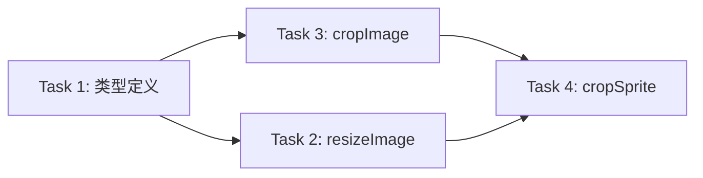

# 任务规划：核心裁剪引擎（PNG）

## 功能概述

实现 PNG 雪碧图的裁剪和缩放功能，包含 3 个核心函数：
- `cropImage()` — 单张裁剪
- `cropSprite()` — 批量裁剪
- `resizeImage()` — 图片缩放

## 任务拆分策略

本功能属于**纯工具函数层**，不直接面向用户，而是被 hooks 层调用。按函数职责拆分为 3 个任务切片，每个切片包含：类型定义 → 函数实现 → 单元测试（TDD）。

## 依赖关系

**关键路径**：Task 1 → Task 2/3（可并行）→ Task 4

---

## Task 1: 类型定义与常量 ✅

### 基本信息

| 项目 | 内容 |
|------|------|
| 任务编号 | TASK-CROP-01 |
| 所属阶段 | 基础设施 |
| 预估工时 | 30 分钟 |
| 依赖任务 | 无 |
| 技术方案章节 | 类型定义 |
| 关联 AC | AC-CROP-01 |

### 任务描述

创建 `src/types/image.ts` 和 `src/utils/constants.ts`，定义 GridConfig 接口和裁剪相关常量。

### 验证标准

1. `GridConfig` 接口包含 `rows: number` 和 `cols: number` 属性
2. `CropResult` 接口包含 `blob: Blob`、`row: number`、`col: number`、`originalSize` 属性
3. `DEFAULT_OUTPUT_SIZE = 240` 常量已定义
4. TypeScript 编译通过，无类型错误

### 通俗解释

定义好数据结构，让后续函数知道"输入是什么样、输出是什么样"。

---

## Task 2: 图片缩放函数 (resizeImage) ✅

### 基本信息

| 项目 | 内容 |
|------|------|
| 任务编号 | TASK-CROP-02 |
| 所属阶段 | 核心函数 |
| 预估工时 | 1 小时 |
| 依赖任务 | TASK-CROP-01 |
| 技术方案章节 | 图片缩放 |
| 关联 AC | AC-CROP-04, AC-CROP-10 |

### 任务描述

实现 `resizeImage(blob: Blob, targetSize: number): Promise<Blob>` 函数，将图片缩放到指定尺寸。

### 验证标准

**正常情况**：
1. 输入 100×100 的 PNG Blob，targetSize=240 → 输出 240×240 的 PNG Blob
2. 输入非正方形（200×100）的 PNG Blob，targetSize=240 → 输出 240×240 的 PNG Blob（拉伸）

**边界情况**：
3. 输入透明背景 PNG → 输出保持透明通道
4. targetSize=0 → 抛出错误 "输出尺寸必须大于 0"
5. targetSize=-1 → 抛出错误 "输出尺寸必须大于 0"

### 通俗解释

把任意尺寸的图片缩放成指定大小的正方形图片。

---

## Task 3: 单张裁剪函数 (cropImage) ✅

### 基本信息

| 项目 | 内容 |
|------|------|
| 任务编号 | TASK-CROP-03 |
| 所属阶段 | 核心函数 |
| 预估工时 | 1.5 小时 |
| 依赖任务 | TASK-CROP-01 |
| 技术方案章节 | 单张裁剪 |
| 关联 AC | AC-CROP-01, AC-CROP-02, AC-CROP-03, AC-CROP-05, AC-CROP-06, AC-CROP-09 |

### 任务描述

实现 `cropImage(image: HTMLImageElement, row: number, col: number, config: GridConfig): Promise<Blob>` 函数，从雪碧图中裁剪指定区域的单张图片。

### 验证标准

**正常情况**：
1. 输入 400×400 雪碧图，config={rows:4, cols:4}，row=0, col=0 → 输出 100×100 的 PNG Blob（左上角）
2. 输入 400×400 雪碧图，config={rows:4, cols:4}，row=3, col=3 → 输出 100×100 的 PNG Blob（右下角）
3. 输入 800×400 非正方形雪碧图，config={rows:2, cols:4}，row=0, col=0 → 输出 200×200 的 PNG Blob

**边界情况**：
4. 输入透明背景 PNG → 输出保持透明通道
5. config.rows=0 → 抛出错误 "行数必须大于 0"
6. config.cols=0 → 抛出错误 "列数必须大于 0"
7. config.rows=-1 → 抛出错误 "行数必须大于 0"
8. row < 0 或 row >= config.rows → 抛出错误 "行索引越界"
9. col < 0 或 col >= config.cols → 抛出错误 "列索引越界"

### 通俗解释

从大图里切出指定位置的那一小块。

---

## Task 4: 批量裁剪函数 (cropSprite) ✅

### 基本信息

| 项目 | 内容 |
|------|------|
| 任务编号 | TASK-CROP-04 |
| 所属阶段 | 核心函数 |
| 预估工时 | 1 小时 |
| 依赖任务 | TASK-CROP-02, TASK-CROP-03 |
| 技术方案章节 | 批量裁剪 |
| 关联 AC | AC-CROP-04, AC-CROP-07, AC-CROP-08 |

### 任务描述

实现 `cropSprite(image: HTMLImageElement, config: GridConfig, outputSize?: number): Promise<Blob[]>` 函数，批量裁剪整张雪碧图并缩放到指定尺寸。

### 验证标准

**正常情况**：
1. 输入 400×400 雪碧图，config={rows:4, cols:4}，outputSize=240 → 返回 16 个 240×240 的 PNG Blob
2. 输入 400×400 雪碧图，config={rows:4, cols:4}，outputSize 不传 → 返回 16 个 240×240 的 PNG Blob（默认值）
3. 输入 400×400 雪碧图，config={rows:4, cols:4}，outputSize=120 → 返回 16 个 120×120 的 PNG Blob

**边界情况**：
4. config.rows=0 → 抛出错误 "行数必须大于 0"
5. outputSize=0 → 抛出错误 "输出尺寸必须大于 0"
6. 返回数组长度 = rows × cols

### 通俗解释

把整张大图切成小块，顺便缩放到需要的尺寸。

---

## AC 覆盖总表

| AC 编号 | 覆盖任务 | 验证方式 |
|---------|----------|----------|
| AC-CROP-01 | TASK-CROP-03 | 单元测试：验证坐标计算 |
| AC-CROP-02 | TASK-CROP-03 | 单元测试：验证输出尺寸 |
| AC-CROP-03 | TASK-CROP-03 | 单元测试：验证透明通道 |
| AC-CROP-04 | TASK-CROP-02, TASK-CROP-04 | 单元测试：验证缩放尺寸 |
| AC-CROP-05 | TASK-CROP-03 | 单元测试：验证 Blob 类型 |
| AC-CROP-06 | TASK-CROP-03 | 单元测试：验证错误抛出 |
| AC-CROP-07 | TASK-CROP-04 | 单元测试：验证数组长度 |
| AC-CROP-08 | TASK-CROP-04 | 单元测试：验证返回数组 |
| AC-CROP-09 | TASK-CROP-03 | 单元测试：验证单张裁剪 |
| AC-CROP-10 | TASK-CROP-02 | 单元测试：验证任意尺寸缩放 |

---

## 验证计划

| 检查项 | 关联任务 | 关联 AC |
|--------|----------|---------|
| TypeScript 编译通过 | TASK-CROP-01~04 | 全部 |
| 所有单元测试通过 | TASK-CROP-02~04 | AC-CROP-01~10 |
| 透明 PNG 测试通过 | TASK-CROP-02, TASK-CROP-03 | AC-CROP-03 |
| 错误边界测试通过 | TASK-CROP-02~04 | AC-CROP-06 |

---

## 任务总览

| 任务编号 | 任务名称 | 预估工时 | 依赖 |
|----------|----------|----------|------|
| TASK-CROP-01 | 类型定义与常量 | 30 分钟 | 无 |
| TASK-CROP-02 | 图片缩放函数 | 1 小时 | TASK-CROP-01 |
| TASK-CROP-03 | 单张裁剪函数 | 1.5 小时 | TASK-CROP-01 |
| TASK-CROP-04 | 批量裁剪函数 | 1 小时 | TASK-CROP-02, TASK-CROP-03 |

**总预估工时**：4 小时

**关键路径**：TASK-CROP-01 → TASK-CROP-02/03（可并行）→ TASK-CROP-04
